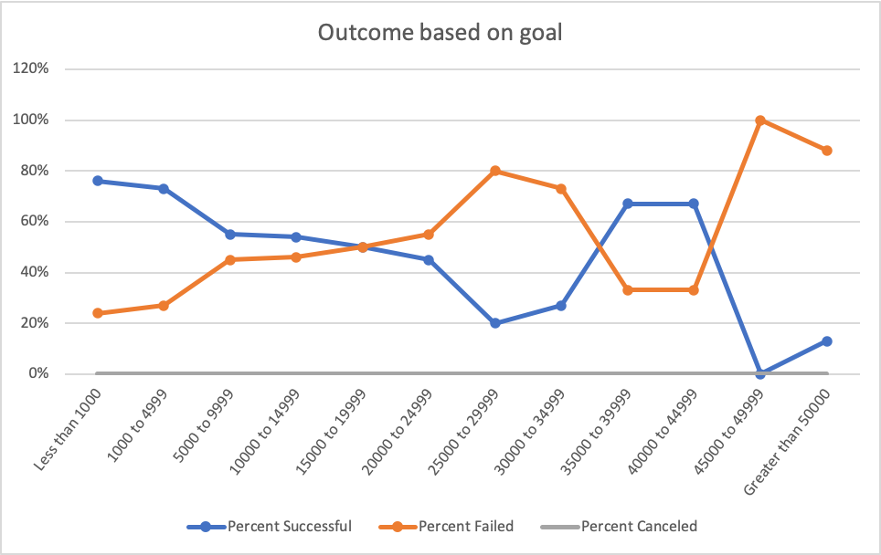

# kickstarter-analysis
Analysis performed on Kickstarter data as part of the Ut Data Analyst Boot Camp.

### Figures

### Recommendation

When looking at the Subcategory Comparison chart, it is evident that plays have the most Kickstarter campaigns by far. In addition, there are more successful campaigns

The initial goal of $20k is very high, especially when looking at successful versus failed campaigns. Failed campaigns were asking for an average of $10k per failed campaign as opposed to the successful campaigns which averaged $5k. 

Additionally, plays tend to be some of the most successful campaigns. When looking at the Goal vs Pledged chart, we see that  To ensure a more successful campaign, it would be recommended to drop the goal from $20k to a lesser amount such as $2,000. This seems to be a range in which more peopled are more willing to contribute to. 

### Challenge

If we look at the Outcome by goal chart, which is only for campaigns for plays, we see a few observations. The success rate of campaigns decreases as the goal increases to $30,000. The success rate also increases within the $35,000 to $45,000 range. The success rate greatly increases once the goal is over that range. 

Looking at the Outcome by Launch Date chart, the most successful campaigns are launched in May. The number of successful campaigns decreases through December. December is the least desirable month to launch campaigns during. 

It is of my opinion that we should still dive into the successful play campaigns in Great Britain as compared to the entire population. Which may help determine if there are other considerations that should be factored in.

